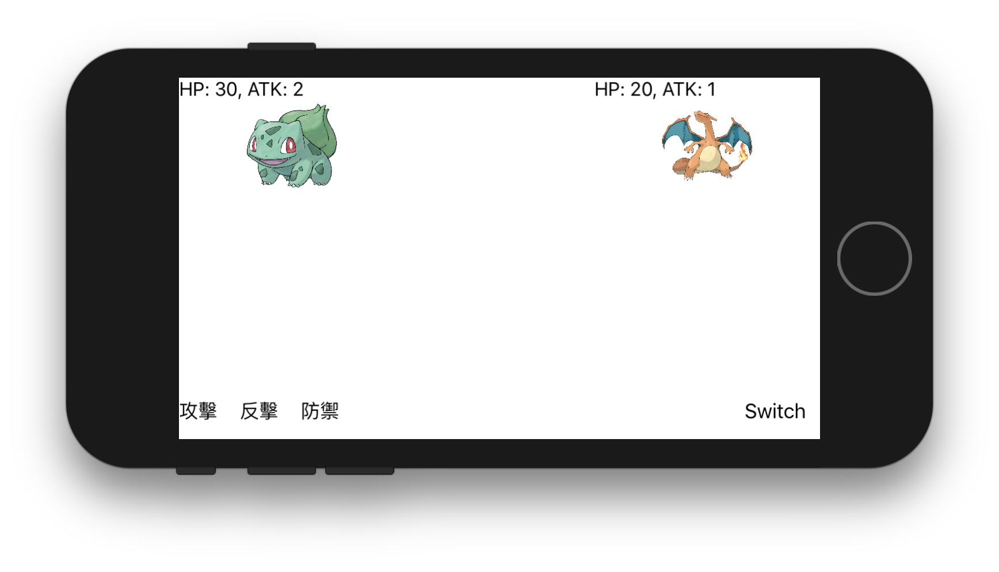

# 剪刀石頭仆街

## 架構

首先從遊戲畫面可知，會有兩個角色，因此暫時先預計會有 Character 這個物件，用以存放角色資料（血量、攻擊等等）。為了能夠顯示 Character 對應的畫面，我建立一個 CharacterView，這個 UIView 只要傳入一個 Character，就能產生對應的 UIView，我們就可以直接用 addSubview 將之加入畫面中顯示。

接下來是三個「按鈕」的部分，每一個按鈕對應一個動作 Action，因此先建立一個 Action 物件，然後考慮到之後可能會有「多個」動作，因此這邊可以用橫向 UICollectionView 來顯示，每個 Cell 都是一個 Action，之後有新增 Action 只要修改 UICollectionView 對應的陣列即可顯示，還具有橫向滾動的功能呢！

最後就是「遊戲邏輯」的部分，為了之後能夠輕易地擴充遊戲邏輯，預計使用 [Strategy Pattern](https://en.wikipedia.org/wiki/Strategy_pattern)，讓遊戲能夠任意更換遊戲邏輯，爽爽開發。因此我先建立一個 GameRule protocol，其用法很簡單，就是傳入兩個 Action，得到一個 ActionResult（兩個行為的結果，也就是遊戲邏輯），目前只有剪刀石頭布的遊戲邏輯，所以我建立一個 PSS 的實體，如果之後有「玩家必勝」的遊戲邏輯，就可以建立一個 PlayerAlwaysWin 的實體，並實做 GameRule protocol 即可。

