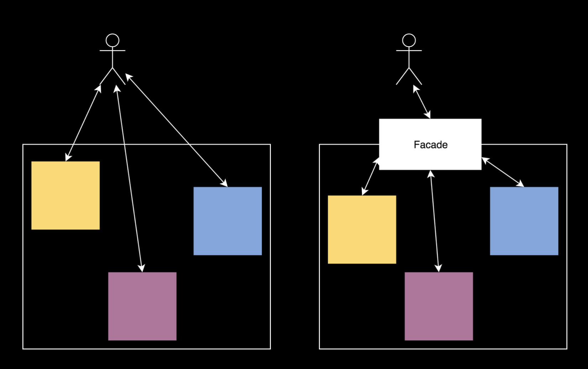

# Facade Pattern



## Facade 模式簡介

Facade 用簡單的界面簡化複雜的運作原理，使用者可以使用 Facade，但也可以跳過 Facade 直接使用子系統。

## 動手練習

情景：從前從前，有個仙廚，為了作出人間最美的炒飯，研究出了一個完美的工廠生產線，如下：

```swift
// 原料
struct 蛋黃 {}
struct 白米 {
    var 熟了: Bool
}
struct 油 {}
struct 蛋白 {
    var 炒香了: Bool
}
struct 蔥 {
    var 炒香了: Bool
}

// 鍋具
class 電鍋 {}
class 冰箱 {}
class 炒飯鍋 {}
class 鍋鏟 {}
```

為了做出最好吃的炒飯，生產線需要以下流程才能生產「完美炒飯」：

1. 使用電鍋蒸熟白米
2. 將白米冰入冰箱放置 24 小時，於炒飯前取出放置室溫 1 小時
3. 熱鍋、加油，並將蛋白與蔥炒香
4. 將白飯與蛋黃拌勻，丟入鍋中炒 7749 秒
5. 於 7750 秒將炒飯倒入盤中冷卻
6. 完成

後來仙廚決定引進人類最新科技「炒飯達人」，只需要將原本的原料（Struct）投入「炒飯達人」，即可在 24 小時後取得香噴噴的「完美炒飯」。

```swift
class 炒飯達人 {}
```

請用以上提供的 Class、Struct 範例，實做「完美炒飯」的生產線以及「炒飯達人」。

## 備註

故事也許很蝦，但是我相信你可以在實做的過程中，「加入自己的香料」，產生更完美的炒飯。

謝謝大家。
