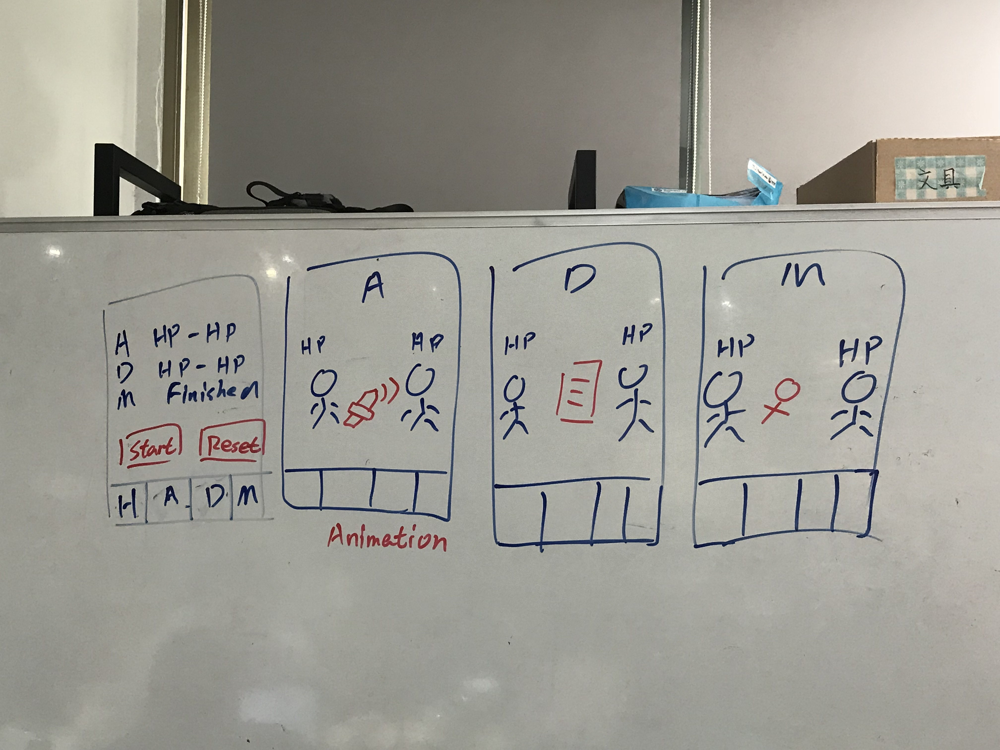

## 主畫面
 - 畫面上顯示三個遊戲的血量進度（玩家 & 魔王）
 - 遇到遊戲結束時，在進度上顯示「Finish」
 - Start 按鈕用來同時啟動三個遊戲。
 - Reset 按鈕用來同時重置三個遊戲。

## 遊戲介面
右邊三個為遊戲介面，當遊戲開始時。

 - 中間紅色的部分會做動畫，比如刀在揮舞。
 - 雙方會開始戰鬥，每次有人損血都會改變畫面中 HP 的數值。
 - 血量的變化要通知主畫面。

遊戲結束時 ( 當某一方血量 <= 0 )
 - 通知主畫面遊戲結束。
 - 停止當前的遊戲。

## 其他
在主畫面點下「Start」以後，其他三個介面的遊戲會開始，所以這過程中如果切換 Tab 都能看到遊戲正在進行。