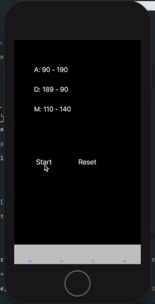

首先從遊戲畫面可知，會有兩個角色，因此暫時先預計會有 Character 這個物件，用以存放角色資料（血量、攻擊等等）。為了能夠顯示 Character 對應的畫面，我建立一個 CharacterView，這個 UIView 只要傳入一個 Character，就能產生對應的 UIView，我們就可以直接用 addSubview 將之加入畫面中顯示。

再來因為有三個分頁，每個分頁都有一場「遊戲」，因此我建立了一個 RingViewController，代表一場遊戲（擂臺），任何分頁只要繼承這個 RingViewController 都能夠成為擂臺。每個擂臺開始時（初始化），都會監聽裁判的指令「開始遊戲」、「重置遊戲」，並且每個擂臺角色互毆後，都會將互毆後的角色狀況（血量）發佈出去，因此主控臺可以接收各擂臺的即使狀況。

至於「遊戲結束」這裡的邏輯歸屬，可以放在主控臺，也可以放在各擂臺，如果以現實狀況來模擬，應該要放在各擂臺，由各擂臺依照角色狀況來判斷是否結束遊戲，這部分是這個專案這次沒有處理好的部分，預計使用 [Strategy Pattern](https://en.wikipedia.org/wiki/Strategy_pattern)，然後初始化擂臺時，就要將「遊戲邏輯」傳入擂臺，方便擂臺判斷輸贏，並將結果發佈給主控臺。
