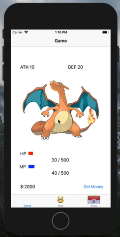

# Readme

## 核心概念：
* 創建一個叫GameManager的class，利用Singleton的概念建立，GameManager裡面存入名為Character（角色）及Player（玩家）的屬性。
1. Character裡面有角色的血量、攻擊、防禦等。
2. Player裡面則有玩家的錢、物品等。
3. 物品的功能性是以Item這個protocol的方式來實現，該protocol定義一方法，來實作不同物品如何控制character的屬性。
## 與畫面溝通方式：

* 第一個畫面是調用GameManager裡面Character的各屬性與Player的錢來顯示。
* 第二個畫面以collectionView來呈現，collectionView的資料就是調用GameManager中的Player的物品來顯示。
* 第三個畫面同樣以collectionView來顯示，裡面建立商品ShoppingItems屬性來讓該collectionView調用。

EX:
1. 當使用者在shoppingItems點按物品，該物品會從shoppingItems移除，並加到player擁有的物品，再透過調用GameManager中player的物品來顯示於第二個畫面。
2. 使用第二個畫面的物品時，會去改變GameManager中character的屬性，連帶控制第一個畫面的顯示。

