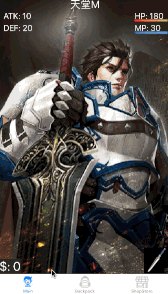

# LineageM 說明

改版後效果

## 改版內容
增加遊戲動畫，需與怪物對戰後才可以獲得金錢
怪物與角色損血都有動畫

## 1. 目的

#### 使用 singleton 方式製作一個遊戲，遊戲內容有三個 tab bar item，分別是

* 主角素質頁面: 顯示 HP, MP, ATK, DEF，點擊攻擊按鈕可以賺錢，但是會扣血

* 背包頁面：顯示道具，可以使用道具，如果沒道具會提示，並切換到商店頁面。最上方顯示道具數目

* 商店頁面：顯示道具，可以購買道具，道具買完會消失，金錢不夠也會跳提示。最上方顯示目前金錢數量。

## 2. 分工

* Main View Controller 及 Packet View Controller 一個人做
因為角色能力與角色擁有道具歸類為同一個項目

* ShopStore View Controller 一個人做
因為道具價格跟道具項目都歸屬同一項目

## 3. 遇到問題

* git 的使用很不熟悉，所以一開始是各寫各的部分，但是需要互相調用資料的時候就會有問題，所以在初步訂定架構後，就先上傳一版，後面再各自開發功能

* 參數命名，圖片檔名，版面設定要一開始就先想好，否則開發過程中會發生不同步的狀況

* 遇到幾個小bug:
1. shopstore 扣錢之後，主頁面無法同步變更 => 因為 label 顯示的指令寫在 ViewDidload裡
2. 使用道具後跳的提示，ＯＫ選項在左邊 => UIAlertController 先加入的 action 會放在陣列裡，並由左到右依序顯示，所以 addAction 時先加入 cancel 的選項
3. HPLayer 切頁面再回來，會顯示滿血 => 因為創建滿血 HPLayer 寫在 viewDidAppear 裡，導致每次切回來都會先顯示滿血

